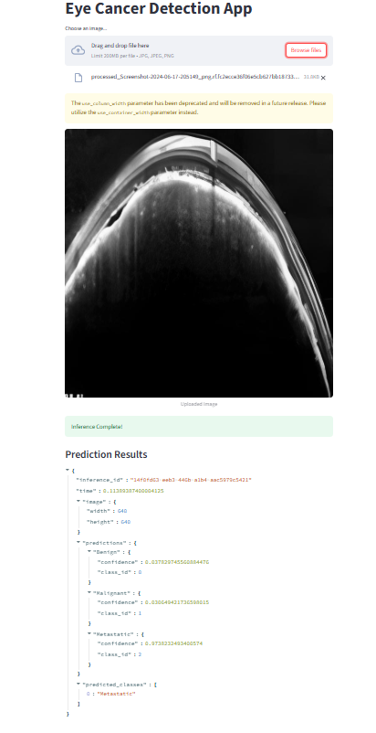

# 👁️ Eye Cancer Detection App

This Streamlit web application allows users to upload an image of an eye and detects potential signs of **eye cancer** using a custom-trained object detection model deployed via Roboflow.

---

## 🚀 Demo

  
> *Upload an eye image to get real-time predictions.*

---

## 🧠 Powered By

- **[Streamlit](https://streamlit.io/)** - For the web interface
- **[Roboflow](https://roboflow.com/)** - For object detection inference API
- **Python Libraries**: `PIL`, `tempfile`, `inference-sdk`

---

## 📦 Features

- ✅ Upload JPG/PNG eye images
- ✅ Real-time detection using Roboflow's hosted model
- ✅ Displays prediction results in JSON format
- ✅ Clean and simple UI

---

## 📁 Project Structure

